[](https://goreportcard.com/report/github.com/lucasepe/g2d) &nbsp;&nbsp;&nbsp; [](https://gocover.io/_badge/github.com/lucasepe/g2d?nocache=g2d)

# `g2D` Programming Language 

**`g2D`** is an educational programming language conceived to: 

- teach concepts of programming to those who approach the art of coding for the first time 
- quick prototyping [canvas rendering 2D contexts](https://developer.mozilla.org/it/docs/Web/API/CanvasRenderingContext2D) - `g2D` builtins api are really similiar to HTML5 Canvas API
- having fun with geometry! It's really easy to play with the scripts and viewing the resulting geometries

You can create also animated geometries (thanks to the `snapshot` builtin function).

**`g2D`** is an [interpreted language](https://en.wikipedia.org/wiki/Interpreted_language) and the interpreter is crafted in Go:

- single binary file
- runs on Linux, MacOS and Windows

To execute a g2d-script simply pass the name to the interpreter:

```bash
$ g2d ./example/lines.g2d
```

If no script is passed to the interpreter it will open a [REPL](https://en.wikipedia.org/wiki/Read–eval–print_loop) shell.

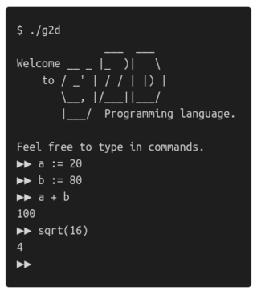

## Installation

Do you have go already installed?

```bash
$ go get -u github.com/lucasepe/g2d
```

## Ready-To-Use Releases 

If you don't want to compile the sourcecode yourself, [here you can find the tool already compiled](https://github.com/lucasepe/g2d/releases/latest) for:

- MacOS
- Linux
- Windows

---

For those who want to see immediately how the language of **`g2D`** feels, here are [some examples](./examples).

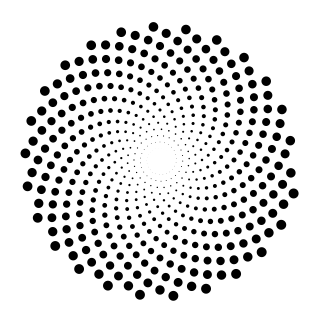 &nbsp;  &nbsp; 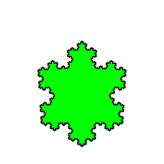

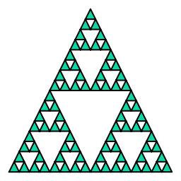 &nbsp; 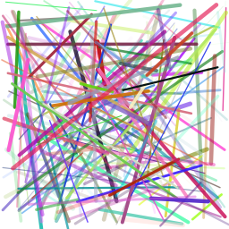 &nbsp; 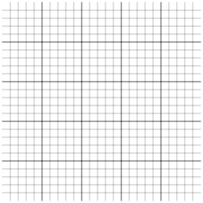

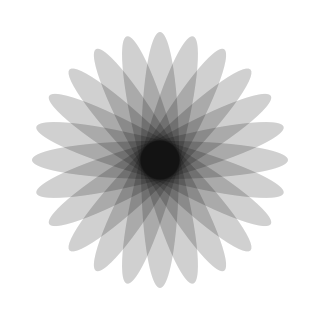 &nbsp; 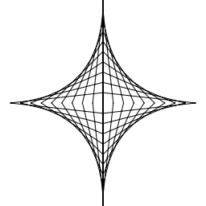 &nbsp; 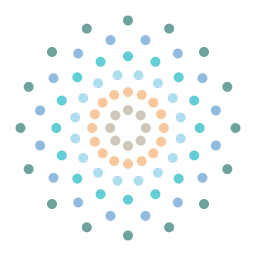 

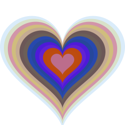 &nbsp;  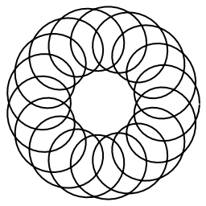 &nbsp; 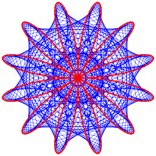 

## The `g2D` Programming Language Syntax

Example-programs can be found beneath [examples/](examples/) which demonstrate these things, as well as parts of the standard-library.

### Types

g2D has the following data types: `null`, `bool`, `int`, `float`, `str`, `array`, `hash`, and `fn`.

Type      | Syntax                                    | Notes                                         |
--------- | ----------------------------------------- | --------------------------------------------- |
null      | `null`                                    |                                               |
bool      | `true false`                              |                                               |
int       | `0 42 1234 -5`                            | is a signed 64-bit integer                    |
float     | `0.5 4.2 1.234 -5.5`                      | is a 64-bit double-precision floating point   |
str       | `"" "foo" "\"quotes\" and a\nline break"` | are immutable arrays of bytes                 |
array     | `[] [1, 2] [1, 2, 3]`                     | grow-able arrays (*use the `push()` builtin*) |
hash      | `{} {"a": 1} {"a": 1, "b": 2}`            | are unordered hash maps                       |


### Bindings

Variables are bounded using the `:=` operator.

```go
a := 3
b := 1.2
```

Variables may be integers, floats, strings, or arrays/hashes.

To update a variable you can simply specify the equals `=` operator:

```go
a := 3    // Binding
a = a + 5 // Updating
```

### Arithmetic operations

`g2D` supports all the basic arithmetic operation of `int` and `float` types.

```go
a := 5
b := 3

c := a + b
d := c / 2
e := d * d
```

### Builtin containers

`cursor` contains two builtin containers: `array` and `hash`.

#### Arrays

An array is a list which organizes items by linear sequence.  Arrays can hold multiple types.

```go
a := [1, 2.3, "hello!"]
b := [false, true, "Hello World", 3, 3.13]
```

Adding to an array is done via the `push` builtin function:

```go
a = append(a, "another")
```

You can iterate over the contents of an array like so:

```go
i := 0
while( i < len(a) ) {
    print( "Array index ", i, " contains ", a[i], "\n")
    i = i + 1
}
```

With the definition we included that produces this output:

```text
Array index 0 contains 1
Array index 1 contains 2.3
Array index 2 contains hello!
Array index 3 contains another
```

#### Hashes

A hash is a key/value container, but note that keys may only be of type `boolean`, `int` and `string`.

```go
a := {
    "name":"monkey",
    true:1,
    7:"seven",
    "amount": 7.5
}

print(a, "\n")            // Outputs: {name: monkey, true: 1, 7: seven, amount: 7.5}
print(a["amount"], "\n")  // Outputs: 7.4

// Updating...
a[7] = "sette"
print(a[7], "\n")         // Outputs: sette
```

You can iterate over the keys in a hash via the `keys` builtin function:

```go
// Fetch all the keys
ids := keys(a)
// ..and iterate
i := 0
while (i < len(ids)) {
    k := ids[i]
    print(i, " Key: ", k, " has Val: ", a[k], "\n")
    i = i + 1
}
```

You can delete keys via `delete` (returns an updated value rather than changing it in-place):

```go
// Delete keys via `delete`
a = delete(a, 8)
a = delete(a, "name")
print(a, "\n")           // Outputs: {7: sette, amount: 7.5, true: 1}
```

### Functions

`g2D` uses `fn` to define a function which will be assigned to a variable for naming/invocation purposes:

```go
sum := fn(a, b) { return a + b }

print(sum(5,3), "\n")       // Outputs: 8
print(sum(2.5,7.5), "\n")   // Outputs: 10
```

Functions can be passed as values to others functions:

```go
addTwo := fn(a, b, f) { 
    return 2 + f(a, b) 
}

tot := addTwo(68, 1, sum)
print(tot, "\n")            // Outputs: 71
```

Functions inside functions

```go
multiplier := fn(q) {
    return fn(x) {
        return x*q
    }
}

multThree := multiplier(3)

print(multThree(2), "\n")  // Outputs: 6
print(multThree(3), "\n")  // Outputs: 9
print(multThree(4), "\n")  // Outputs: 12
```

### If-else statements

`g2D` supports `if-else` statements.

```go
max := fn(a, b) {
    if (a > b) {
        return a;
    } else {
        return b;
    }
}

print( max(1, 2) )  // Outputs: 2
```

### Switch Statements

`g2D` supports the `switch` and `case` expressions:

```go
switch n := randi(10) {
    case n % 2 == 0 {
        print(n, " is even", "\n")
    }
    default {
        print(n, " is odd", "\n")
    }
}
```

### While Loops

`g2D` supports only one looping construct, the `while` loop:

```go
i := 30
while (i > 0) {
    print(i, " ")
    i = i - 10
}
// 30 20 10
```

## Builtin functions

### Core

Function               | Description
---------------------- | -------------------------------------------------------------------------- | 
`args()`               | returns an array of command-line options passed to the program             |
`exit([status])`       | exits the program immediately with the optional status or 0                |
`input([prompt]`       | reads a line from standard input optionally printing the specified prompt  |
`print(...)`           | output a string to stdout                                                  |
`printf(pattern, ...)` | output a string to stdout (formatted according the specified pattern)      |
`sprintf(pattern, ...)`| like `printf(...)` but returns a _string_                                  |
`bool(val)`            | converts value to a bool                                                   |
`float(val)`           | converts decimal value str to _float_ - if _val_ is invalid returns _null_ |
`int(val)`             | converts decimal value str to _int_ - if _val_ is invalid returns _null_   |
`str(val)`             | returns the string representation of _val_                                 |
`len(iterable)`        | returns the length of the iterable (_string_, _array_ or _hash_)           |
`append(array, val)`   | returns a new array with value pushed onto the end of array                |
`keys(hash)`           | returns the keys of the specified hash                                     |
`delete(hash, key)`    | returns a new has with the given key deleted                               |

### Calculation

Function                | Description
----------------------- | -------------------------------------------------------------------------- | 
`abs(x)`                | returns the absolute value of _x_                                          |
`atan(x)`               | returns the arc tangent, in radians, of _x_                                |
`atan2(x, y)`           | returns the arc tangent of _y/x_                                           |
`cos(x)`                | returns the cosine of the radian argument _x_                              |
`degrees(angle)`        | converts radians into degrees                                              | 
`hypot(p, q)`           | returns `sqrt(p*p + q*q)`                                                  |
`lerp(start, stop, amt)`| calculates a number between two numbers at a specific increment            |
`map(v, b1, e1, b2, e2)`| re-maps a number from one range to another                                 |
`max(v1....vn)`         | returns the largest value in a sequence of numbers                         |
`min(v1....vn)`         | returns the smallest value in a sequence of numbers                        |
`pow(x, y)`             | returns `x**y`, the base _x_ exponential of _y_                            |
`sin(x)`                | returns the sine of the radian argument _x_                                |
`sqrt(x)`               | returns the square root of _x_                                             |
`radians(angle)`        | converts a degree measurement to its corresponding value in radians        |
`randf([min], [max])`   | returns a random float between min and max - by default min=0.0 and max=1.0|
`randi([min], [max])`   | returns a random int between min and max                                   |

### Graphics

Function                              | Description
------------------------------------- | ------------------------------------------------------------------------------------- | 
`size(w,[h])`                         | when both _w_ and _h_ are specified creates a rectangular image otherwise creates a squared one |
`width()`                     | returns the main drawing image width   |
`height()`                    | returns the main drawing image height   |
`viewport(xMin, xMax, yMin, yMax, xOffset, yOffset)` | sets up user-defined coordinate system; performs a screen reset (drawings are cleared)|
`pencolor(hexcolor)`                  | sets the pen color to the specified _hexcolor_; example _pencolor("#ff0000")_         |
`pencolor(r, g, b, [a])`              | sets the pen color to _r,g,b,a_ values - should be between 0 and 1, inclusive         |
`pensize(width)`                      | sets the pen line thickness to the specified _width_                                  |
`dashes([s1, s2, ...sn])`     | sets the current dash pattern to use (call with zero arguments to disable dashes) |
`stroke([preserve])`                  | strokes the current path with the current color and line width the path is cleared after this operation.<br/> If preserve is _true_ the path will be preserved |
`fill([preserve])`                    | fills the current path with the current color. Open subpaths are implicity closed.<br/> The path is cleared after this operation. If preserve is true the path is preserved after this operation |
`line(x1, y1, x2, y2)`                | draws a line from point _(x1, y1)_ to point _(x2, y2)_ |
`arc(x, y, r, sa, ea)`                | draws a circular arc centered at _(x, y)_ with a radius of _r_.<br/> The path starts at _sa_ angle_, ends at _ea_ angle, and travels in the direction given by anticlockwise |
`circle(x, y, r)`                     | draws a circle centered at _[x, y]_ coordinates and with the radius _r_               |
`ellipse(x, y, rx ,ry)`               | draws an ellipse centered at [x, y] coordinates and with the radii _rx_ and _ry_      |
`rect(x, y, w, h, [tl, tr, br, bl])`  | draws a (w x h) rectangle with upper left corner located at _(x, y)_.<br/> If only one radius is specified, all the corners have the same bending, if _tl_, _tr_, _br_, _bl_ are specified, each corner can have a different curvature |
`quad(x1,y1, x2,y2, x3,y3, x4,y4)`    | draws a a four sided polygon using the provided vertices |
`triangle(x1,y1, x2,y2, x3,y3)`       | draws a triangle using the provided vertices |
`text(str, x, y, [ax, ay])`             | draws the specified text at the specified anchor point<br/>anchor point is _x - w * ax_, _y - h * ay_, where _w_, _h_ is the size of the text<br/>when omitted _ax=0.5_, _ay=0.5_ to center the text at the specified point |
`textWidth(str)`                      | returns the rendered width of the specified text given the current font face |
`fontHeight(size)`                    | sets the font height of the current font face |
`beginPath()`                         | starts a new path                             |
`moveTo(x, y)`                        | sets the begin of a new subpath starting at the specified _(x, y)_ point |
`lineTo(x, y)`                        | adds a line segment to the current path starting at the current point. <br/>If there is no current point, it is equivalent to MoveTo(x, y) |
`arcTo(x1, y1, x2, y2, r)`            | adds a circular arc to the current sub-path, using the given control points and radius |
`quadraticCurveTo(x1, y1, x2, y2)`  | adds a quadratic Bézier curve to the current sub-path using the given control points |
`routeTo(distance, angle)`    | adds a line segment to the current path heading to the specified angle and stopping at the specified distance |
`closePath()`                         | adds a line segment from the current point to the beginning of the current subpath.<br/> If there is no current point, this is a no-op. |
`push()`                         | saves the current state of the graphic context by pushing it onto a stack |
`pop()`                      | restores the last saved graphic context state from the stack |
`rotate(degrees, [x, y] )`            | updates the current matrix with a anticlockwise rotation. <br/> If _x, y_ is specified, rotation occurs about this point, otherwise rotation occurs about the origin |
`scale(sx, sy, [x, y])`           | updates the current matrix with a scaling factor when _x_,_y_ are specified scaling occurs about this point, otherwise scaling occurs about origin. |
`translate(x, y)`                   | updates the current matrix with a translation |
`identity()`                      | resets the current transformation matrix to the identity matrix |
`snapshot([filename])`                | creates a PNG image with the current drawings. <br/>If _filename_ is omitted, it will be autogenerated with a progressive counter, that will be incremented on each <br/> `snapshot()` invocation; this is useful if you wants to generate an animation later (using all the generated PNG images). |
`xpos()`                      | returns the current X position (if there is a current point) |
`ypos()`                      | returns the current Y position (if there is a current point) |
